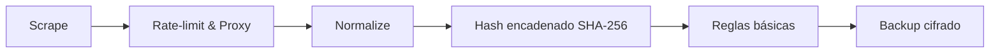

# Proyecto C.E.N.T.I.N.E.L. / C.E.N.T.I.N.E.L. Project

[](LICENSE)


[](https://github.com/userf8a2c4/centinel-engine/actions/workflows/ci.yml)
[](https://github.com/userf8a2c4/centinel-engine/actions/workflows/codeql.yml)
[](https://github.com/userf8a2c4/centinel-engine/actions/workflows/deploy-dashboard.yml)

Auditoría continua y verificable de datos públicos del CNE con trazabilidad criptográfica integral. / Continuous, verifiable auditing of CNE public data with end-to-end cryptographic traceability.

Máxima frecuencia operativa de hasta cada 5 minutos para observación técnica persistente y neutral. / Maximum operational cadence up to every 5 minutes for persistent, neutral technical observation.

**Quick Start** • **Core Flow** • **Key Features** • **Navigation** • **Legal**

## ¿Qué es C.E.N.T.I.N.E.L.? / What is C.E.N.T.I.N.E.L.?

C.E.N.T.I.N.E.L. (Centinela Electrónico Neutral Técnico Íntegro Nacional Electoral Libre) es una plataforma de auditoría electoral neutral orientada a alta integridad, diseñada para monitorear de forma continua datos JSON públicos del CNE, preservar evidencia verificable y sostener reproducibilidad total en cada ejecución.

C.E.N.T.I.N.E.L. se posiciona como una iniciativa pionera de auditoría técnica electoral en Honduras y Centroamérica, con foco de preparación operacional para las elecciones generales de Honduras 2029 bajo un principio de neutralidad política absoluta.

## Estado actual / Current status

En desarrollo — núcleo congelado feb 2026 — rama `dev-v9`. / In development — core frozen Feb 2026 — branch `dev-v9`.

## Flujo principal / Core Flow



## Quick Start

### Requisitos previos / Prerequisites

- Python **3.10+**
- **Poetry**
- Entorno con capacidad de ejecución periódica para ciclos de auditoría continuos

### Comandos principales / Core commands

```bash
make init && make pipeline
```

- `make init`: prepara entorno y dependencias operativas.
- `make pipeline`: ejecuta un ciclo completo (`--once`) del flujo principal.
- Configuración centralizada en `config/prod/`, `config/dev/` y `config/secrets/`.

## Características clave / Key Features

| Feature | Description |
|---|---|
| Auditoría continua de datos JSON públicos del CNE | Monitoreo técnico sostenido con enfoque de evidencia verificable y cobertura operacional recurrente. |
| Frecuencia máxima de ejecución cada 5 minutos | Capacidad de observación casi en tiempo real para detectar cambios, inconsistencias y eventos relevantes de forma temprana. |
| Trazabilidad criptográfica | Encadenamiento SHA-256 y generación de Merkle root por lote para integridad, verificabilidad y no alteración detectable de artefactos. |
| Reproducibilidad total | Pipeline determinístico y procedimientos replicables para permitir validación independiente de resultados y evidencia. |
| Normalización y validación de artefactos | Estandarización de datos de entrada y controles de consistencia para mantener calidad técnica en análisis posteriores. |
| Controles operativos de adquisición | Rate limiting, rotación de proxy/user-agent y manejo robusto de captura para continuidad de auditoría. |
| Reglas técnicas de análisis electoral | Marco base para detección de anomalías y expansión controlada mediante perfiles core/research de reglas. |
| Resguardo seguro de evidencia | Backups cifrados y bundle reproducible de verificación con SHA-256 por archivo y Merkle root consolidado. |
| Calidad, seguridad y resiliencia | Suites de pruebas funcionales, seguridad y caos en `tests/` para fortalecer confiabilidad operativa. |
| Neutralidad política absoluta | Diseño institucional y técnico no partidario, centrado exclusivamente en transparencia, evidencia y auditoría. |

## Navegación rápida / Quick Navigation

<details>
<summary><strong>Navegación rápida / Quick Navigation</strong></summary>

| Recurso / Resource                  | Ruta / Path |
|-------------------------------------|-------------|
| Documentación completa / Full docs  | [docs/](docs/) |
| Matriz legal / Legal matrix         | [docs/legal_compliance_matrix.md](docs/legal_compliance_matrix.md) |
| Arquitectura / Architecture         | [docs/architecture.md](docs/architecture.md) |
| Extender reglas UPNFM               | [docs/upnfm_integration_guide.md](docs/upnfm_integration_guide.md) |
| Modelo core/research de reglas      | [config/prod/rules_core.yaml](config/prod/rules_core.yaml) / [config/prod/rules_research.yaml](config/prod/rules_research.yaml) |
| Bundle de verificación de evidencia | [docs/VERIFICATION-BUNDLE.md](docs/VERIFICATION-BUNDLE.md) |

</details>

## Descargo legal / Legal Disclaimer

Este proyecto se limita al procesamiento y auditoría de datos públicos, bajo cumplimiento del marco legal aplicable y criterios de uso responsable de información electoral.

No constituye afiliación institucional ni respaldo político de ninguna organización, candidatura o actor electoral. Su propósito es estrictamente técnico: observación, trazabilidad y verificación independiente de evidencia.

Para detalle normativo, consultar la matriz legal: [docs/legal_compliance_matrix.md](docs/legal_compliance_matrix.md).

## Licencia y metadatos / License & Metadata

Licencia: **GNU AGPL-3.0**.

Metadatos operativos clave: auditoría continua, reproducibilidad integral, trazabilidad criptográfica (SHA-256 chain + Merkle root), neutralidad política absoluta y preparación técnica para el ciclo electoral general de Honduras 2029.
