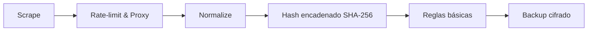

# Proyecto C.E.N.T.I.N.E.L.

<sub>Centinela Electrónico Neutral Técnico Íntegro Nacional Electoral Libre.</sub>

[](LICENSE)


[](https://github.com/userf8a2c4/centinel-engine/actions/workflows/ci.yml)
[](https://github.com/userf8a2c4/centinel-engine/actions/workflows/codeql.yml)
[](https://github.com/userf8a2c4/centinel-engine/actions/workflows/deploy-dashboard.yml)

Auditoría continua y verificable de datos públicos del CNE. / Continuous, verifiable auditing of CNE public data.

**Estado actual / Current status:** En desarrollo — núcleo congelado feb 2026 — rama `dev-v9`. / In development — core frozen Feb 2026 — branch `dev-v9`.

## Flujo principal / Core Flow



## Quick Start

```bash
make init && make pipeline
```

- Requisitos mínimos / Minimum requirements: **Python 3.10+**, **Poetry**.
- `make init` prepara entorno y dependencias operativas.
- `make pipeline` ejecuta un ciclo completo (`--once`) del flujo principal.
- Configuración centralizada en `config/prod/`, `config/dev/`, `config/secrets/`.

## Características clave / Key Features

- Pipeline reproducible para auditoría continua.
- Normalización y validación de artefactos.
- Hash chain SHA-256 para trazabilidad de evidencia.
- Rotación de proxy/user-agent y control de rate limit.
- Reglas básicas para anomalías electorales.
- Backup seguro multi-destino con cifrado.
- Verification bundle reproducible (SHA-256 por archivo + Merkle root del lote).
- Suites de pruebas, seguridad y caos en `tests/`.

## Navegación rápida / Quick Navigation

<details>
<summary><strong>Ver enlaces principales del sistema y documentación</strong></summary>

| Recurso / Resource | Ruta / Path |
|---|---|
| Documentación completa / Full docs | [`docs/`](docs/) |
| Matriz legal / Legal matrix | [`docs/legal_compliance_matrix.md`](docs/legal_compliance_matrix.md) |
| Arquitectura / Architecture | [`docs/architecture.md`](docs/architecture.md) |
| Extender reglas UPNFM / Extend UPNFM rules | [`docs/upnfm_integration_guide.md`](docs/upnfm_integration_guide.md) |
| Modelo core/research de reglas | [`config/prod/rules_core.yaml`](config/prod/rules_core.yaml) / [`config/prod/rules_research.yaml`](config/prod/rules_research.yaml) |
| Bundle de verificación de evidencia | [`docs/VERIFICATION-BUNDLE.md`](docs/VERIFICATION-BUNDLE.md) |

</details>

## Descargo legal / Legal Disclaimer

Uso exclusivo sobre datos públicos y bajo cumplimiento normativo aplicable. / Public-data use only, under applicable legal compliance. Ver detalle completo en la [matriz legal](docs/legal_compliance_matrix.md).

## Licencia y metadatos / License & Metadata

Licencia: **GNU AGPL-3.0**. Proyecto centrado en neutralidad técnica, trazabilidad y mantenibilidad operativa.
