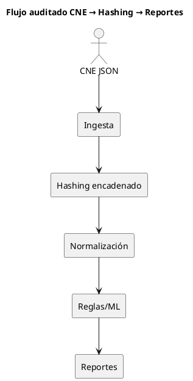
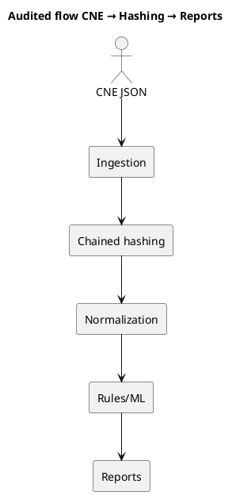

# Arquitectura de Proyecto C.E.N.T.I.N.E.L.

## [ES] Español

### Visión general
C.E.N.T.I.N.E.L. sigue una arquitectura tipo pipeline para que cada etapa sea **independiente, verificable y auditable**.

**Entrada → Hash → Normalización → Análisis → Almacenamiento → Publicación**

### Componentes principales
- **Fuentes públicas**: endpoints oficiales publicados por instituciones electorales.
- **Ingesta y hashing** (`scripts/download_and_hash.py`): descarga, valida y genera hashes encadenados.
- **Normalización** (`core/`, `src/`): homogeniza estructuras para comparación temporal.
- **Reglas de análisis** (`command_center/rules/`): aplica detección de variaciones y anomalías.
- **Registro histórico** (`data/`, `hashes/`): conserva evidencia inmutable.
- **Publicación y anclaje** (`centinel_engine/`): ancla resultados en L2 para reforzar integridad.

### Flujo de datos (paso a paso)
1. **Captura** de datos públicos en intervalos definidos.
2. **Hashing encadenado** para garantizar integridad y orden temporal.
3. **Normalización** de campos, tipos y estructuras.
4. **Análisis** con reglas deterministas y configurables.
5. **Persistencia** de snapshots y métricas para auditoría.
6. **Publicación** de reportes y eventos detectados.

### Diagrama de arquitectura (PlantUML)
El siguiente diagrama resume el flujo principal desde los JSON del CNE hasta los reportes auditables.

### Verificación por terceros
Guía para reproducir diffs y validar integridad sin sesgos:

1. **Preserve el JSON original** tal como fue publicado por el CNE (sin normalizar) y registre el timestamp de captura.
2. **Ejecute el pipeline de hashing** con el mismo input usando `scripts/download_and_hash.py`, asegurando que los hashes generados coincidan con `hashes/`.
3. **Normalice y compare** resultados con un diff determinista, por ejemplo:
   - `jq -S . snapshot_1.json > snapshot_1.norm.json`
   - `jq -S . snapshot_2.json > snapshot_2.norm.json`
   - `diff -u snapshot_1.norm.json snapshot_2.norm.json`
4. **Revise reportes y alertas** generados y confirme que cada alerta apunte al hash de entrada correspondiente.

Estos pasos permiten que observadores externos (OEA, UE, Carter Center) repliquen la evidencia y comparen salidas sin depender de herramientas propietarias.

### Beneficios de esta arquitectura
- **Trazabilidad completa:** cada snapshot se vincula a su fuente, tiempo y hash.
- **Reproducibilidad:** cualquier tercero puede repetir el flujo con las mismas entradas.
- **Modularidad:** puedes reemplazar una etapa sin romper las demás.
- **Seguridad de evidencia:** el encadenamiento de hashes hace visibles las alteraciones.

---

## [EN] English

### Overview
C.E.N.T.I.N.E.L. follows a pipeline architecture so every stage is **independent, verifiable, and auditable**.

**Input → Hash → Normalization → Analysis → Storage → Publishing**

### Core components
- **Public sources**: official endpoints published by electoral institutions.
- **Ingestion and hashing** (`scripts/download_and_hash.py`): downloads, validates, and generates chained hashes.
- **Normalization** (`core/`, `src/`): standardizes structures for time-based comparisons.
- **Analysis rules** (`command_center/rules/`): applies configurable anomaly and variation detection.
- **Historical logging** (`data/`, `hashes/`): preserves immutable evidence.
- **Publishing and anchoring** (`centinel_engine/`): anchors results on L2 to reinforce integrity.

### Data flow (step by step)
1. **Capture** public data on a defined schedule.
2. **Chained hashing** to guarantee integrity and temporal order.
3. **Normalization** of fields, types, and structures.
4. **Analysis** with deterministic, configurable rules.
5. **Persistence** of snapshots and metrics for audit.
6. **Publishing** of technical reports and detected events.

### Architecture diagram (PlantUML)
The diagram below summarizes the primary flow from CNE JSON inputs to auditable reports.

### Third-party verification
Guidance to reproduce diffs and validate integrity without bias:

1. **Preserve the original JSON** exactly as published by the CNE (no normalization) and record the capture timestamp.
2. **Run the hashing pipeline** with the same input via `scripts/download_and_hash.py`, ensuring generated hashes match `hashes/`.
3. **Normalize and compare** using a deterministic diff, for example:
   - `jq -S . snapshot_1.json > snapshot_1.norm.json`
   - `jq -S . snapshot_2.json > snapshot_2.norm.json`
   - `diff -u snapshot_1.norm.json snapshot_2.norm.json`
4. **Review reports and alerts** and confirm each alert references the corresponding input hash.

These steps allow external observers (OAS, EU, Carter Center) to reproduce evidence and compare outputs without relying on proprietary tooling.

### Benefits of this architecture
- **Full traceability:** each snapshot links to source, time, and hash.
- **Reproducibility:** any third party can re-run the flow with identical inputs.
- **Modularity:** you can replace a stage without breaking the rest.
- **Evidence security:** chained hashes make tampering visible.
